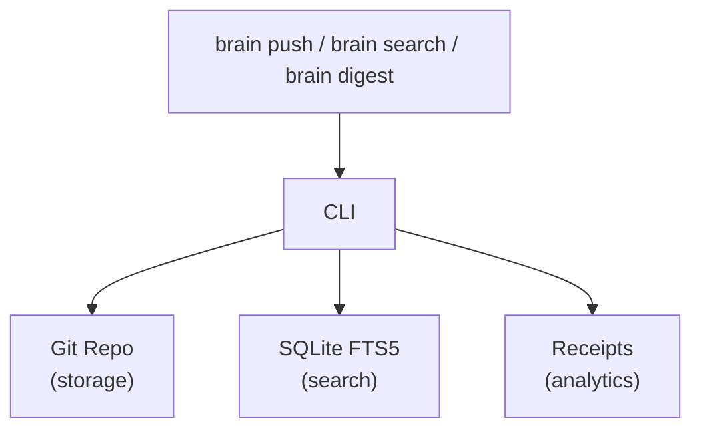

# brain

A CLI tool and MCP server for sharing technical knowledge across a team. Entries are stored as markdown files in a git repository, indexed locally with SQLite FTS5 for full-text search, and exposed to AI agents via the Model Context Protocol.

## How it works



- **Storage**: Markdown files with YAML frontmatter, committed to a shared git repo
- **Search index**: SQLite FTS5 virtual table (`~/.brain/cache.db`), rebuilt on sync
- **Analytics**: JSON receipt files in `_analytics/receipts/YYYY-MM-DD/`, tracked per-read
- **MCP server**: Exposes the same functionality to AI agents over stdio

## Installation

```bash
git clone https://github.com/vraspar/brain.git
cd brain
npm install
npm run build
npm link    # makes 'brain' available globally
```

Requires Node.js 18+ and git.

## Quick start

```bash
# Create a new brain (first person on the team)
brain init --name "Acme Engineering" --remote https://github.com/acme/brain-hub.git

# Or join an existing brain (teammates)
brain connect https://github.com/acme/brain-hub.git

# See recent entries
brain digest

# Search for something
brain search "kubernetes deployment"

# Read a specific entry
brain show k8s-deployment-guide

# Publish a new entry
brain push --title "Docker Multi-Stage Builds" --type guide --file ./docker-guide.md

# Pull latest from remote
brain sync
```

## CLI reference

All commands support `--format json` for machine-readable output and `-q, --quiet` to suppress non-essential output.

### `brain init`

Create a new brain hub. Initializes a local git repo with directory structure, generates a README, and optionally pushes to a remote.

```
brain init [--name <name>] [--remote <url>] [--author <name>]
```

Without `--name`, runs an interactive wizard. See [docs/commands.md](docs/commands.md) for full details.

### `brain connect <url>`

Join an existing brain by cloning its repository.

```bash
brain connect https://github.com/your-team/brain-hub.git
```

Creates `~/.brain/config.yaml` and `~/.brain/repo/`. Builds the FTS5 search index from existing entries. Detects author from `git config user.name`. Supports `--author` to override.

### `brain join <url>`

Alias for `brain connect`.

### `brain push`

Write a new entry to the repository. Commits and pushes to the remote.

```
brain push --title <title> --file <path> [--type guide|skill] [--tags <csv>] [--summary <text>]
```

- `--title` (required): Entry title. Slugified to produce the entry ID (e.g. "Docker Tips" becomes `docker-tips`).
- `--file` (required): Path to a markdown file containing the entry body.
- `--type`: `guide` (default) or `skill`.
- `--tags`: Comma-separated list. If omitted, tags are auto-detected by matching content against a built-in dictionary of 56 tech terms (docker, kubernetes, react, typescript, etc.).
- `--summary`: Short description of the entry.

The entry is written to `guides/<slug>.md` or `skills/<slug>.md`, committed with message `Add <type>: <title>`, and pushed.

### `brain digest`

Show entries created or updated within a time window.

```
brain digest [--since <period>]
```

- `--since`: Time window in format `Nd`, `Nw`, or `Nm` (days, weeks, months). Default: since last digest, or `7d` on first run.

Displays new and updated entries in separate tables with read counts. Shows the most-accessed entry as a highlight. Updates `lastDigest` in config so the next run picks up from where you left off.

### `brain search <query>`

Full-text search across all entries using FTS5 with BM25 ranking.

```
brain search "kubernetes deployment" [--limit <n>]
```

- `--limit`: Maximum results (default: 20).

Searches across title, tags, content, and summary fields. Falls back to LIKE-based search if the FTS5 query fails (e.g. unsupported syntax).

### `brain show <entry-id>`

Display the full content of a specific entry.

```
brain show k8s-deployment-guide
```

Shows title, author, type, status, tags, dates, summary, related repos/tools, and the full markdown body. Records a read receipt.

### `brain list`

List all entries in the index.

```
brain list [--type guide|skill] [--author <name>]
```

Returns a table of entries sorted by last updated. Both filters can be combined.

### `brain stats`

Show read activity for your entries.

```
brain stats [--period <period>] [--author <name>]
```

- `--period`: Time window (default: `7d`).
- `--author`: Show stats for a different author (default: you).

Reads receipt files from `_analytics/receipts/` and aggregates by entry, showing total reads and unique readers.

### `brain sync`

Pull latest changes from the remote and rebuild the search index.

```
brain sync
```

Uses `git pull --ff-only`. Reports added, updated, and removed entries. Updates `lastSync` in config.

### `brain serve`

Start the MCP server on stdio transport. Not intended to be run directly — configure your MCP client to invoke it (see below).

## MCP server

The MCP server exposes brain functionality to AI agents. It provides both tools (agent-initiated actions) and resources (ambient context).

### Client configuration

Add to your MCP client settings (Claude Desktop, VS Code, etc.):

```json
{
  "mcpServers": {
    "brain": {
      "command": "brain",
      "args": ["serve"]
    }
  }
}
```

### Tools

#### `push_knowledge`

Publish a new entry.

| Parameter | Type | Required | Description |
|-----------|------|----------|-------------|
| `title` | string | yes | Entry title |
| `content` | string | yes | Markdown content |
| `type` | `"guide"` \| `"skill"` | no | Default: `"guide"` |
| `tags` | string[] | no | Categorization tags |
| `summary` | string | no | Brief summary |

#### `search_knowledge`

Full-text search across entries.

| Parameter | Type | Required | Description |
|-----------|------|----------|-------------|
| `query` | string | yes | Search query |
| `type` | `"guide"` \| `"skill"` | no | Filter by type |
| `limit` | number | no | Max results (default: 10) |

#### `whats_new`

Get entries created or updated within a time window.

| Parameter | Type | Required | Description |
|-----------|------|----------|-------------|
| `since` | string | no | Time window, e.g. `"7d"`, `"2w"`, `"1m"` (default: `"7d"`) |
| `type` | `"guide"` \| `"skill"` | no | Filter by type |

#### `get_entry`

Retrieve a specific entry by its ID.

| Parameter | Type | Required | Description |
|-----------|------|----------|-------------|
| `id` | string | yes | Entry ID (slug) |

#### `brain_stats`

View read activity stats.

| Parameter | Type | Required | Description |
|-----------|------|----------|-------------|
| `author` | string | no | Filter by author (default: current user) |
| `period` | string | no | Time window (default: `"7d"`) |

### Resources

| URI | MIME type | Description |
|-----|-----------|-------------|
| `brain://digest` | `text/markdown` | Entries from the last 7 days, formatted as markdown |
| `brain://stats` | `text/markdown` | Read activity table for the current user (last 7 days) |

## Configuration

Brain stores its configuration at `~/.brain/config.yaml`. Created automatically by `brain init` or `brain connect`.

```yaml
remote: "https://github.com/your-team/brain-hub.git"
local: "/home/you/.brain/repo"
author: "your-name"
hubName: "Acme Engineering"
lastSync: "2026-03-23T12:00:00.000Z"
lastDigest: "2026-03-23T12:00:00.000Z"
```

| Field | Required | Description |
|-------|----------|-------------|
| `remote` | No | Git remote URL. Absent for local-only brains. |
| `local` | Yes | Path to the local clone |
| `author` | Yes | Your name (from `git config user.name`) |
| `hubName` | No | Human-readable brain name |
| `lastSync` | No | Timestamp of last `brain sync` |
| `lastDigest` | No | Timestamp of last `brain digest` |

## Entry format

Entries are markdown files with YAML frontmatter. Stored in `guides/` or `skills/` within the repo.

```markdown
---
title: "K8s Deployment Guide"
author: "alice"
created: "2026-03-20T10:00:00.000Z"
updated: "2026-03-22T14:30:00.000Z"
tags:
  - kubernetes
  - k8s
type: guide
status: active
summary: "Step-by-step guide for deploying to our K8s cluster"
related_repos:
  - https://github.com/your-team/infra
related_tools:
  - kubectl
  - helm
---

Your markdown content here.
```

**Required fields**: `title`, `author`, `created`, `updated`, `type`

**Optional fields**: `tags`, `status` (default: `active`), `summary`, `related_repos`, `related_tools`

**Types**: `guide`, `skill`

**Statuses**: `active`, `stale`, `archived`

## Data layout

```
~/.brain/
├── config.yaml                  # Brain configuration
├── cache.db                     # SQLite FTS5 search index (WAL mode)
└── repo/                        # Cloned git repository
    ├── guides/                  # Guide entries (.md)
    ├── skills/                  # Skill entries (.md)
    └── _analytics/
        └── receipts/
            └── YYYY-MM-DD/      # Daily directories
                └── reader-entryid-abc123.json
```

Receipt files are JSON:

```json
{
  "entry_id": "k8s-deployment-guide",
  "reader": "bob",
  "timestamp": "2026-03-23T09:15:00.000Z",
  "source": "cli"
}
```

## Project structure

```
src/
├── index.ts              # CLI entry point (Commander)
├── types.ts              # Shared TypeScript interfaces
├── commands/
│   ├── init.ts           # brain init (interactive wizard)
│   ├── connect.ts        # brain connect
│   ├── join.ts           # brain join (alias for connect)
│   ├── push.ts           # brain push (includes auto-tagger)
│   ├── digest.ts         # brain digest
│   ├── search.ts         # brain search
│   ├── show.ts           # brain show
│   ├── list.ts           # brain list
│   ├── stats.ts          # brain stats
│   ├── sync.ts           # brain sync
│   └── serve.ts          # brain serve
├── core/
│   ├── config.ts         # Config load/save (~/.brain/config.yaml)
│   ├── entry.ts          # Entry parsing, serialization, scanning
│   ├── index-db.ts       # SQLite FTS5 index (create, search, query)
│   ├── receipts.ts       # Read receipt recording and aggregation
│   └── repo.ts           # Git repo operations (init, join, sync)
├── mcp/
│   ├── server.ts         # MCP server setup and lifecycle
│   ├── tools.ts          # MCP tool registrations
│   └── resources.ts      # MCP resource registrations
└── utils/
    ├── git.ts            # Git wrapper (simple-git)
    ├── output.ts         # Terminal formatting (tables, colors)
    ├── slug.ts           # Title-to-slug conversion
    └── time.ts           # Time window parsing, relative dates
```

## Development

```bash
npm install              # Install dependencies
npm run build            # Compile TypeScript (strict, ESM, NodeNext)
npm test                 # Run tests (vitest)
npm run dev              # Run CLI without building (tsx)
```

## Dependencies

| Package | Purpose |
|---------|---------|
| `commander` | CLI framework |
| `better-sqlite3` | FTS5 search index |
| `simple-git` | Git operations |
| `gray-matter` | Markdown frontmatter parsing |
| `@modelcontextprotocol/sdk` | MCP server |
| `chalk` | Terminal colors |
| `cli-table3` | Terminal tables |

## License

MIT — see [LICENSE](LICENSE)
