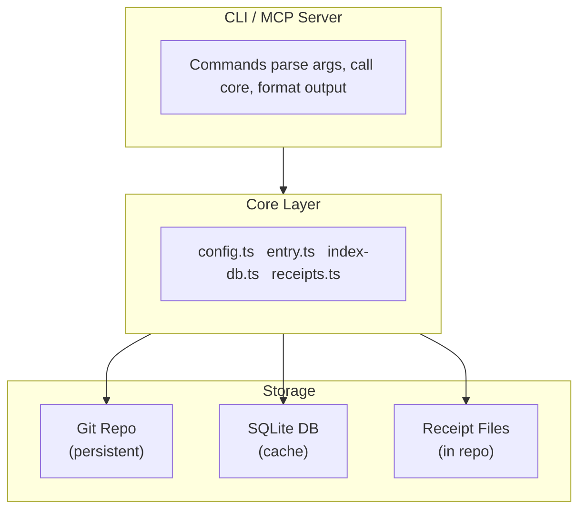
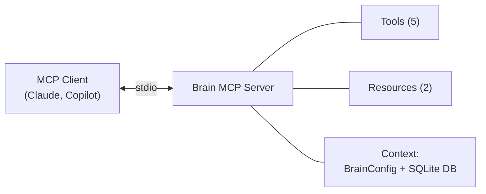
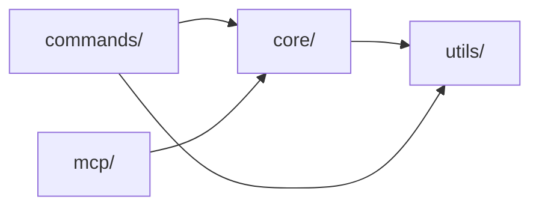

# Architecture

This document covers how Brain works internally: storage, indexing, sync, analytics, and the MCP server.

## Overview

Brain has four layers:



- **Git repo** is the source of truth for entries. It's a regular git repository that can be hosted anywhere.
- **SQLite database** is a local cache for fast search. It can be rebuilt from the repo at any time.
- **Receipt files** are stored in the git repo under `_analytics/` so they sync across team members.

## Storage layer

### Entry files

Entries are markdown files with YAML frontmatter, stored in two directories:

```
repo/
├── guides/
│   ├── k8s-deployment-guide.md
│   └── ci-pipeline-setup.md
└── skills/
    └── react-testing-patterns.md
```

The filename (without `.md`) is the entry ID (slug). Slugs are generated from titles by lowercasing, removing special characters, and replacing spaces with hyphens.

### Frontmatter schema

Each entry file has YAML frontmatter parsed by [gray-matter](https://github.com/jonschlinkert/gray-matter):

```yaml
---
title: "K8s Deployment Guide"        # Required
author: "alice"                       # Required
created: "2026-03-20T10:00:00.000Z"   # Required, ISO 8601
updated: "2026-03-22T14:30:00.000Z"   # Required, ISO 8601
tags:                                 # Optional, array of strings
  - kubernetes
  - k8s
type: guide                           # Required: "guide" or "skill"
status: active                        # Optional: "active" (default), "stale", "archived"
summary: "Step-by-step guide..."      # Optional
related_repos:                        # Optional
  - https://github.com/team/infra
related_tools:                        # Optional
  - kubectl
  - helm
---
```

Malformed entries (missing required fields, invalid type/status) are skipped with a warning during scanning rather than causing a hard failure.

### Entry scanning

`scanEntries(repoPath)` reads all `.md` files from `guides/` and `skills/`, parses each with gray-matter, validates required frontmatter fields, and returns an array of `Entry` objects. This is called during sync, push, and index rebuild.

## Search index (SQLite FTS5)

Brain maintains a SQLite database at `~/.brain/cache.db` for fast full-text search. The database uses WAL journal mode.

### Schema

```sql
CREATE TABLE entries (
  id TEXT PRIMARY KEY,
  title TEXT NOT NULL,
  type TEXT NOT NULL,
  author TEXT NOT NULL,
  created_at TEXT NOT NULL,
  updated_at TEXT NOT NULL,
  tags TEXT,              -- comma-separated
  status TEXT DEFAULT 'active',
  related_repos TEXT,     -- comma-separated
  related_tools TEXT,     -- comma-separated
  summary TEXT,
  content TEXT NOT NULL,
  file_path TEXT NOT NULL
);

CREATE VIRTUAL TABLE entries_fts USING fts5(
  title, tags, content, summary,
  content='entries', content_rowid='rowid'
);
```

### FTS5 triggers

Three triggers keep the FTS5 index in sync with the entries table:

- **After INSERT**: adds the new row to FTS5
- **After DELETE**: removes the row from FTS5
- **After UPDATE**: deletes the old row and inserts the new one

### Index rebuild

`rebuildIndex(db, entries)` does a full rebuild:
1. Deletes all rows from `entries`
2. Runs `INSERT INTO entries_fts(entries_fts) VALUES('rebuild')` to resync FTS5
3. Inserts all entries in a single transaction

This runs on `brain sync`, `brain join`/`brain connect`, and `brain push`.

### Search flow

1. User query is sanitized: FTS5 operators (`AND`, `OR`, `NOT`, `NEAR`) are stripped, special characters removed, each term wrapped in double quotes
2. FTS5 `MATCH` query runs with `ORDER BY rank` (BM25 scoring)
3. If FTS5 fails (malformed query), falls back to `LIKE` search on `title`, `content`, `tags`
4. Results are returned as `Entry[]` sorted by relevance

### Why FTS5 over alternatives

- Zero infrastructure (no Elasticsearch, no external service)
- Fast (sub-millisecond for typical knowledge base sizes)
- BM25 relevance ranking built in
- Ships with `better-sqlite3` (no native extension compilation issues)

## Sync mechanism

`brain sync` runs `git pull --ff-only` and rebuilds the index.

### Sync flow

```
1. Load config
2. Scan entries before pull (get IDs)
3. git pull --ff-only
4. Scan entries after pull (get IDs)
5. Diff: added = after - before, removed = before - after
6. Rebuild FTS5 index from disk
7. Update lastSync in config
```

Fast-forward-only pulls prevent merge conflicts. If the pull fails (divergent histories), the user needs to resolve manually in `~/.brain/repo/`.

### Push flow (brain push)

```
1. Read content from --file
2. Create Entry object with frontmatter
3. Write to guides/<slug>.md or skills/<slug>.md
4. git add <file> && git commit && git push
5. Rebuild FTS5 index
6. Record read receipt
```

## Receipt system (analytics)

Read receipts track who reads what. They are JSON files stored in the git repo so they sync across team members.

### Receipt storage

```
repo/_analytics/receipts/
├── 2026-03-21/
│   ├── alice-k8s-deployment-guide-a1b2c3.json
│   └── bob-k8s-deployment-guide-d4e5f6.json
└── 2026-03-23/
    └── alice-ci-pipeline-setup-789abc.json
```

Directory names are dates (`YYYY-MM-DD`). File names follow the pattern `{reader}-{entryId}-{random6hex}.json`. The random suffix prevents collisions when the same person reads the same entry multiple times in a day.

### Receipt format

```json
{
  "entry_id": "k8s-deployment-guide",
  "reader": "bob",
  "timestamp": "2026-03-23T09:15:00.000Z",
  "source": "cli"
}
```

The `source` field distinguishes CLI reads from MCP reads.

### When receipts are recorded

| Action | Source |
|--------|--------|
| `brain show <id>` | `cli` |
| `brain digest` (for each displayed entry) | `cli` |
| `brain push` (for the author) | `cli` |
| MCP `get_entry` | `mcp` |
| MCP `search_knowledge` (for each result) | `mcp` |

### Stats aggregation

`getStats(repoPath, author, period)`:
1. Computes a cutoff date from the period string (`7d` → 7 days ago)
2. Lists date directories in `_analytics/receipts/` that are >= cutoff
3. Reads all `.json` files in matching directories
4. Filters by timestamp >= cutoff
5. Groups by `entry_id`, counts total reads and unique readers
6. Returns sorted by read count (descending)

This is a file-scan operation, not a database query. Stats are computed fresh on each call.

### Trade-off: eventual consistency

Receipts are committed to git and synced via `brain sync`. This means:
- Your own reads appear immediately in your stats
- Teammate reads appear after the next `brain sync`
- Stats are not real-time across the team — they are eventually consistent

This is intentional. Real-time stats would require a server. Git-based receipts give us analytics with zero infrastructure.

## MCP server

The MCP server (`src/mcp/server.ts`) uses the `@modelcontextprotocol/sdk` package with stdio transport.

### Architecture



### Initialization

1. `loadConfig()` — reads `~/.brain/config.yaml`
2. `createIndex(dbPath)` — opens/creates SQLite DB with schema
3. Creates `BrainMcpContext` with config and db reference
4. Registers 5 tools and 2 resources
5. Scans entries from disk and rebuilds the FTS5 index
6. Connects to stdio transport

### Context sharing

All tools and resources receive a shared `BrainMcpContext` containing the config and database handle. This means:
- All tools share the same database connection
- The index is only built once at startup
- Config is loaded once and shared

### Graceful shutdown

On SIGINT/SIGTERM, the server closes the SQLite database before exiting. This prevents WAL file corruption that can occur if the process is killed while a write is in progress.

## Module structure

```
src/
├── index.ts              ← CLI entry (Commander program, command registration)
├── types.ts              ← Shared interfaces (Entry, BrainConfig, Receipt, etc.)
├── commands/             ← One file per CLI command
│   └── *.ts              ← Each exports a Commander Command
├── core/                 ← Business logic (no CLI or MCP dependencies)
│   ├── config.ts         ← Load/save ~/.brain/config.yaml
│   ├── entry.ts          ← Parse/serialize markdown entries, scan directories
│   ├── index-db.ts       ← SQLite FTS5 create/rebuild/search/query
│   ├── receipts.ts       ← Record and aggregate read receipts
│   └── repo.ts           ← Git operations (init, join, sync)
├── mcp/                  ← MCP server layer
│   ├── server.ts         ← Server creation and lifecycle
│   ├── tools.ts          ← Tool registrations (push, search, whats_new, get, stats)
│   └── resources.ts      ← Resource registrations (digest, stats)
└── utils/                ← Pure utilities
    ├── git.ts            ← Git wrapper (simple-git)
    ├── output.ts         ← Terminal table formatting
    ├── slug.ts           ← Title → slug conversion
    ├── time.ts           ← Time window parsing, relative dates
    └── url.ts            ← URL validation and credential sanitization
```

### Dependency direction



Commands and MCP handlers depend on core. Core depends on utils. There are no circular dependencies. The core layer has no knowledge of CLI or MCP concerns — it is purely business logic operating on entries, config, and git.
